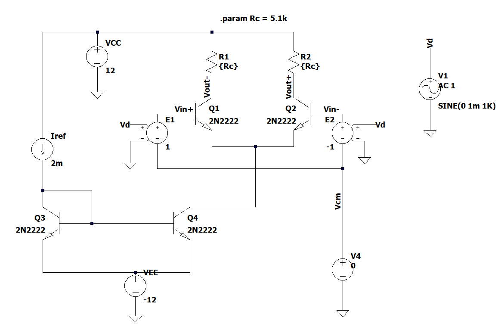

# Discrete Amplifier Design
Design decisions and circuit schematics can be found at:
- [Circuit](schematics)
- [Design workflow](theory/Workflow.md)

# Stage 1.0: Differential Amplifier (Resistive Load)
**Specifications:** A_d > 50, CMRR > 60 dB, consumption < 10 mA and Simetric sources: V_CC = 12 V, V_EE = -12V.

This design implements the following features:
- Resistive load (R_C = 5.1 kΩ)
- Tail current I_tail = 2 mA
- Implementation using 2N2222 transistors
- Small-signal AC characterization: 1 mV test signal at 1 kHz

# Circuit Diagram

## Simulation Results
| Parameter | Value Obtained | Specification | Status |
|-----------|----------------|---------------|---------|
| A_d (Differential Gain) | 200 (46.07 dB) | > 50 | CORRECT |
| A_CM (Common-Mode Gain) | 0.049 (-26.18 dB) | - | - |
| V_C (Collector Voltage) | 6.4 V | - | - |
| CMRR | 72.19 dB | > 60 dB |  CORRECT|
| CMIR | -9.62 V to +7.25 V | ±10 V | Warning at positive limit|
| Power Consumption | 8.35 mA | < 10 mA | CORRECT  |
| Bandwidth (BW) | 6.02 MHz | > 100 kHz |  CORRECT |
| R_id (Differential Input Resistance) | 10.05 kΩ | - | - |
| R_icm (Common-Mode Input Resistance) | 5.19 MΩ | - | - |
| R_o (Output Resistance) | 9.69 kΩ | - | - |

All values in the table are simulation results from LTspice. Theoretical derivations are documented in [Workflow.md](theory/Workflow.md).

# Stage 1.1: Differential Amplifier (Active Load)
*Enhanced version of Stage 1.0 - Under development*

